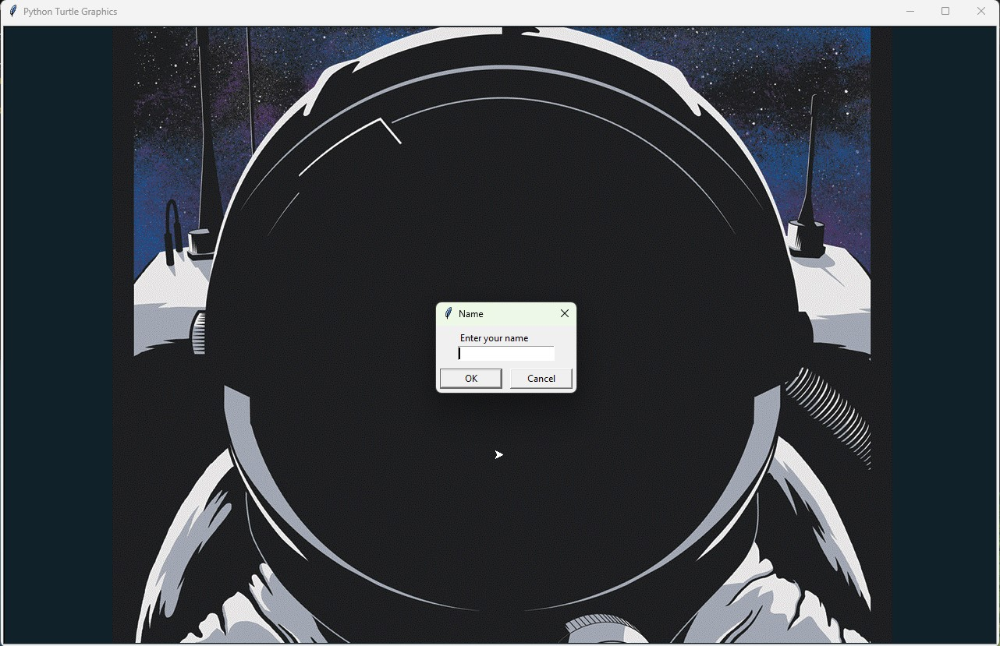
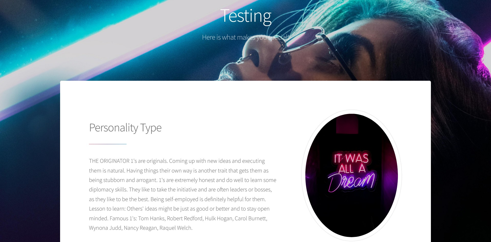

When I began work on `personality_calculator` as my final project for the Intro to Programming course at MJC, the assignment requirements were fairly straightforward:

* Provide a [graphical user interface] to collect user input
* Perform some type of arithmetic calculations
* Display results to the user

At first glance, `personality_calculator` appears to be a simple personality analysis application. The program calculates [Enneagram] type, [western zodiac] sign, [Chinese zodiac] sign, and [biorhythm] information based on a user's date of birth before presenting the results to the user.

However, the most interesting part of the project was not the calculations themselves. As development progressed, the project became an exercise in answering a different question:

> How much functionality can be built using only Python's standard library?

The answer turned out to be considerably more than I expected.

:::{important}
This project was not intended to promote or lend legitimacy to any of the [pseudosciences] listed above.
:::

## Portability
Before writing much code, I established one design goal that would influence nearly every decision that followed: the application should be [portable].

I wanted the software to run anywhere [Python] 3.6 was installed without requiring additional setup, [permissions], or [libraries]. If I could place application on a USB drive and run it immediately on another [machine], I would consider that a success.

Python's [standard library] provided exactly the tools needed to accomplish this.

Rather than relying on hardcoded paths, the application dynamically creates its working directories relative to the application's location as see in [](#personcalc.utils).

```{code} python
:filename: utils.py
:label: personcalc.utils
:caption: Demonstration of operating system independence with `os` module and dynamic path generation in `utils.py`.

...
import os

# Get absolute path to current directory of personality_calculator application
HERE = os.path.dirname(os.path.abspath(__file__))

# Create the directory within the personality_calcualtor app if it does not not exist
if not os.path.exists(os.path.join(HERE, "public")):
    os.makedirs(os.path.join(HERE, "public"))

# Assign directory path to global constant variable
PUBLIC = os.path.join(HERE, "public")
...
```

This approach offers several advantages. The application does not depend on operating system specific [paths], does not require elevated permissions, and keeps all generated files within its own directory structure. Because it relies on the `os` module rather than platform specific assumptions, the same code developed on [Windows] was able to run during presentations on [Ubuntu] without modifications.

Perhaps more importantly, portability encouraged me to rely on tools already with Python rather than immediately searching for third-party solutions. Once that foundation was in place, another challenge emerged. As additional functionality was added, keeping the code organized quickly became more important than portability itself.

## Managing complexity through modularity
The initial version of the application was small enough that organization was not a major concern. That changed as logging, database support, report generation, and calculation logic were introduced. Even modest projects can become difficult to maintain when all functionality lives in a single file.

To avoid that problem, I organized the application into a collection of focused modules. Each module owns a specific responsibility as emphasized in [](#personcalc.struct).

```{code} txt
:label: personcalc.struct
:caption: `personality_calculator` application structure.
.
├── __main__py               # application driver
├── database.py              # database operations
├── gui.py                   # turtle GUI functions
├── personality.py           # enneagram definitions
├── zodiac.py                # zodiac definitions and functions
├── webpage.py               # report generation
├── utils.py                 # support functions
├── data/
|   ├── schema.sql           # database schema
|   └── personality.db       # application database
├── logs/
|   └── personality.log      # activity log
├── public/
|    └── index.html          # generated report
└── static/
    ├── final.gif            # GUI background
    └── main.css             # report style
```
The `gui` handles user interaction. The `zodiac` and `personality` modules handle calculations and reference data, with additional support calculations in the `utils` module. The `database` module handles persistence, and the `webpage` module generates reports.

This separation made development easier because problems could be isolated to individual components rather than traced through a large monolithic script. The program still followed a structured programming design, but the [modular] organization helped establish clear boundaries between responsibilities.

As the architecture became more organized, I began looking for opportunities to extend the application beyond the original assignment requirements. The first enhancement was [persistence].

## Persisting results
The assignment only required displaying calculated results to the user. Once the application could reliably generate those results, I asked myself a simple question:

> What happens after the user closes the program?

Storing the information opened possibilities that were not available with a purely transient application. Results could be reviewed later, analyzed, or used to generate reports.

To accomplish this, I added two forms of persistence. The first was a simple [logging] system that records user activity. This mostly served as a debugging tool. The second was an [SQLite database].

The database layer is intentionally small. Rather than introducing additional abstraction, the module focuses on three responsibilities:
1. Establishing a connection to the SQLite database
1. Initializing the [schema]
1. Inserting generated results

This simplicity is a direct result of earlier design decisions. Because portability was a primary goal, SQLite was selected as the persistence mechanism since it ships with Python's standard library and requires no external services. Likewise, the modular architecture encouraged isolating database concerns into a dedicated module rather than scattering SQL operation throughout the application. It aligned perfectly with the project's portability goals. 

As a result, the entire database layer remains compact enough to be examined in its entirety. The implementation shown in [](#personcalc.database) demonstrates how the module encapsulates connection management, schema initialization, and record insertion while remaining largely independent from the rest of the application.

The use of `contextlib.closing()` ensures that database connections are properly released after each operation, while parameterized queries (`?` placeholders) separate SQL statements from user supplied values. Although the application was never intended for public deployment, adopting parameter binding early helped reinforce good database practices and provides protection against [SQL injection] attacks.

The complete implementation of `database.py` is shown below.

```{code} python
:filename: database.py
:label: personcalc.database
:caption: Complete database module for the `personality_calculator` application.

#!usr/bin/env Python3
"""This file contains the database functions for the personality calculator."""
from contextlib import closing
import os
import sqlite3

# import path to data directory from utils.py
from utils import DATA

# create the 'personality.db' file in the data directory if it does not exist
# assign 'personality.db' filepath to DATABASE constant
DATABASE = os.path.join(DATA, "personality.db")

# create the 'schema.sql' file in the data directory if it does not exist
# assign 'schema.sql' filepath to SCHEMA constant
SCHEMA = os.path.join(DATA, "schema.sql") 

# establish connection to 'personalty.db'
def connect_db():
    """Connects to the application database."""
    return sqlite3.connect(DATABASE)

def init_db():
    """Initializes the application database."""
    # ensure the connection closes even if the operation fails
    with closing(connect_db()) as database:
        # initialize application database as defined in 'schema.sql'
        with open(SCHEMA, mode="r") as schema:
            database.cursor().executescript(schema.read())
        database.commit()
    # connection closes at end of code block without needing to call database.close()

def insert_entry(**kwargs):
    """Inserts an entry into the database."""
    # ensure the connection closes even if the operation fails
    with closing(connect_db()) as database:
        database_cursor = database.cursor()
        # insertion statement with parameterized bindings to discourage SQL injection
        database_cursor.execute(
            "INSERT INTO users(user_name, date_of_birth, enneagram, "
            + "chinese_zodiac, western_zodiac, physical, emotional, "
            + "intellectual) VALUES (?, ?, ?, ?, ?, ?, ?, ?)",
            (
                kwargs.get("user_name"),
                kwargs.get("birth_date"),
                kwargs.get("enneagram"),
                kwargs.get("chinese_zodiac_key"),
                kwargs.get("western_zodiac_key"),
                kwargs.get("physical"),
                kwargs.get("emotional"),
                kwargs.get("intellectual"),
            ),
        )
        database.commit()
```
::::{hint} `**kwargs` for `database.insert_entry` are defined in `schema.sql`
:class: dropdown
```{code} sql
:filename: schema.sql
CREATE TABLE IF NOT EXISTS users (
    id INTEGER PRIMARY KEY AUTOINCREMENT,
    user_name TEXT NOT NULL,
    date_of_birth TEXT NOT NULL,
    enneagram INTEGER NOT NULL,
    chinese_zodiac TEXT NOT NULL,
    western_zodiac TEXT NOT NULL,
    physical INTEGER NOT NULL,
    emotional INTEGER NOT NULL,
    intellectual INTEGER NOT NULL
)
```
::::

Once the application could collect, calculate, and store its information, the next challenge became presenting the results in a meaningful way.

## Separating input from presentation
Initially, I expected to only display the generated results directly with the [Turtle interface]. The more I experimented with the idea, the less appealing it became. Turtle worked well for collecting information, but presenting larger amounts of formatted data through it felt cumbersome. At the same time, every machine capable of running Python already had access to something designed specifically for presenting information: a web browser.

That realization led to one of the more interesting architectural decisions in the project. The Turtle GUI would collect user input. The web browser would display results. [](#personcalc.interfaces) illustrates this separation of responsibilites.

:::{figure}
:label: personcalc.interfaces

(personcalc.interfaces.gui)=


(personcalc.interfaces.report)=


Application interfaces.
:::

When the application closes the GUI, a custom HTML report is generated and automatically opened using Python's `webbrowser` module. This creates a clean separation between concerns as illustrated in [](#personcalc.diagram).

:::{figure} ../assets/images/person_calc/diagram.jpg
:label: personcalc.diagram
:alt: Diagram showing separation of concerns within the application structure.

Diagram representing separation of concerns within the application structure. 
:::

The application focuses on generating information while the browser focuses on displaying it. Choosing the browser as the presentation layer solved one problem, but immediately introduced another.

If the browser was going to display the results, what should the report actually look like?

## Standing on the shoulders of others
At this point, I faced a familiar software engineering problem. Should I build an entire [front end] from scratch, or should I leverage an existing solution?

For a course project, the answer was straightforward.

The report layout is derived from the [Stellar] template from [HTML5 UP]. I modified the template and injected application generated results into predefined sections before displaying the report to the user.

This significantly reduced development time while also providing a [responsive] layout that had already been tested across different screen sizes and devices. By adopting an existing template, I was able to focus my effort on application logic rather than front end implementation.

Of course, every design decision introduces compromises.

## Constraints and imperfections
Every project reflects the knowledge, experience, and time constraints of the developer who built it. One area that feels clunky is the user input workflow. The Turtle interface collects the user's birth month, day, and year through separate dialog boxes. Compared to a modern date picker, the experience is far from ideal.

The design was largely a result of two factors:
1. Limited familiarity with the Turtle library
1. Project deadlines

In hindsight, the implementation has one unexpected advantage. By collecting values individually, the application can apply basic constraints to each field and take advantage of the limited [validation] already present in Turtle functions.

The project also contains no custom error handling. Most protections come from the standard library modules themselves. This was a conscious decision based on the project scope. Robust validation and [exception handling] are important, but implementing them would have significantly expanded the project's complexity beyond the goals of the course.

:::{figure} ../assets/images/person_calc/validation.jpg
:label: personcalc.validation
:alt: Flowchart of the basic validation logic for user input.

Flowchart of the basic validation logic for user input. If input meets validations rules, continue. Otherwise, prompt user to renter invalid input.
:::

With the benefits of hindsight, there as several aspects I would approach differently today.

## What I would change
The first changes would be organizational. Renaming `__main__.py` to `app.py` and replacing the `static` directory with `assets` better communicates their purpose. Some functionality currently located in `utilis.py` could be moved closer to where it is used, reducing unnecessary abstraction.

The largest architectural change would involve the user interface. If I were rebuilding the project today, I would seriously consider eliminating Turtle altogether and using the browser as both the input and presentation layer. Because the application already generates HTML reports, extending that approach to user interaction would simplify the overall architecture considerably. However, this may be a much more involved process and challenge my initial design goal to use only Python's standard library.

I would also explore object-oriented design. At the time this project was written, [object-oriented programming] was beyond the scope of the course. The procedural and modular design served the project well, but revisiting it with a stronger understanding of classes and object relationships would be an interesting exercise.

## Lesson learned
Looking back, the personality calculations are probably the least interesting aspect of the project. The more valuable lesson was discovering how much functionality can be assembled from tools that are already available. Using only Python's standard library, the application provides:
* Graphical user interface
* File logging
* Database persistence
* HTML report generation
* Browser integration
* Cross platform portability

More importantly, the project served as an introduction to architectural thinking. Every significant feature emerged from a design decision. Every design decision involved tradeoffs. Choosing SQLite improved portability but limited database capabilities. Using Turtle simplified GUI development but complicated presentation. Reusing an existing template accelerated development while sacrificing some control over the final design. Learning to evaluate those tradeoffs ultimately proved more valuable than any individual feature the application provides.

`personality_calculator` began as an introductory programming assignment. By the time it was finished, it had become an exploration of portability, modular design, persistence, and the practical realities of software engineering. The resulting application may be small, but the lessons learned while building it will influence how I approach software projects in the future.

% overview
[graphical user interface]:https://en.wikipedia.org/wiki/Graphical_user_interface
[Enneagram]:https://en.wikipedia.org/wiki/Enneagram_of_Personality
[western zodiac]:https://en.wikipedia.org/wiki/Zodiac
[Chinese zodiac]:https://en.wikipedia.org/wiki/Chinese_zodiac
[biorhythm]:https://en.wikipedia.org/wiki/Biorhythm_(pseudoscience)
[pseudosciences]:https://en.wikipedia.org/wiki/Pseudoscience

% portability
[portable]:https://en.wikipedia.org/wiki/Portable_application
[Python]:https://en.wikipedia.org/wiki/Python_(programming_language)
[permissions]:https://en.wikipedia.org/wiki/File-system_permissions
[libraries]:https://en.wikipedia.org/wiki/Library_(computing)
[machine]:https://en.wikipedia.org/wiki/Machine
[standard library]:https://en.wikipedia.org/wiki/Standard_library
[paths]:https://en.wikipedia.org/wiki/Path_(computing)
[Windows]:https://en.wikipedia.org/wiki/Microsoft_Windows
[Ubuntu]:https://en.wikipedia.org/wiki/Ubuntu

% modularity
[modular]:https://en.wikipedia.org/wiki/Modular_programming
[persistence]:https://en.wikipedia.org/wiki/Persistence_(computer_science)

% persistence
[logging]:https://en.wikipedia.org/wiki/Logging_(computing)
[SQLite database]:https://en.wikipedia.org/wiki/SQLite
[schema]:https://en.wikipedia.org/wiki/Database_schema
[SQL injection]:https://en.wikipedia.org/wiki/SQL_injection

% presentation
[Turtle interface]:https://en.wikipedia.org/wiki/Turtle_graphics
[front end]:https://en.wikipedia.org/wiki/Front-end_web_development
[Stellar]:https://html5up.net/stellar
[HTML5 UP]:https://html5up.net/
[responsive]:https://en.wikipedia.org/wiki/Responsive_web_design

% constraints
[validation]:https://en.wikipedia.org/wiki/Data_validation
[exception handling]:https://en.wikipedia.org/wiki/Exception_handling_(programming)

% change
[object-oriented programming]:https://en.wikipedia.org/wiki/Object-oriented_programming
